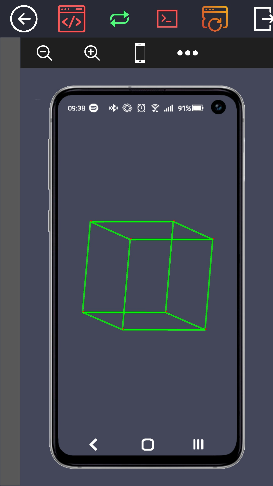
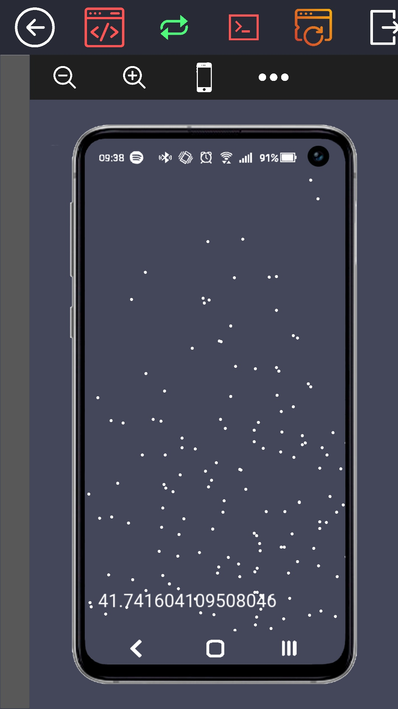
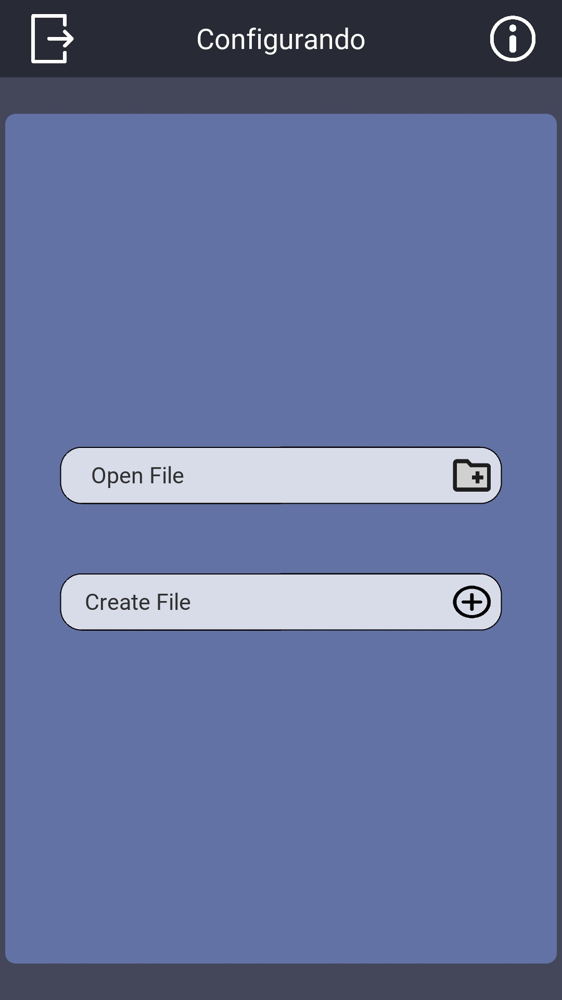
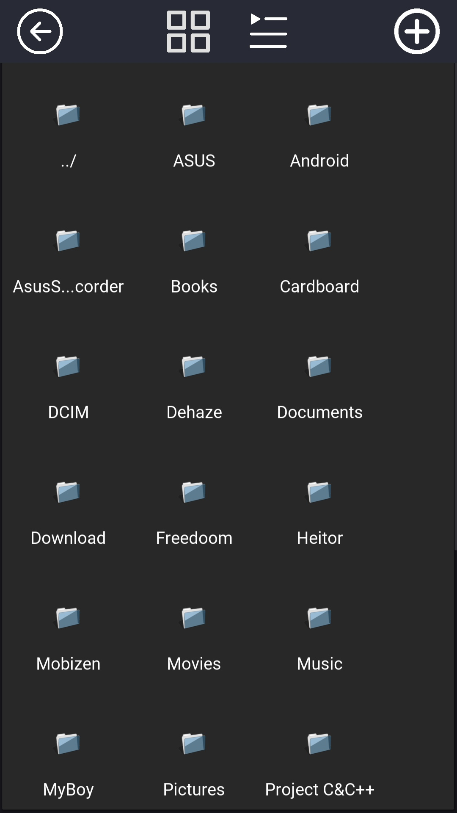
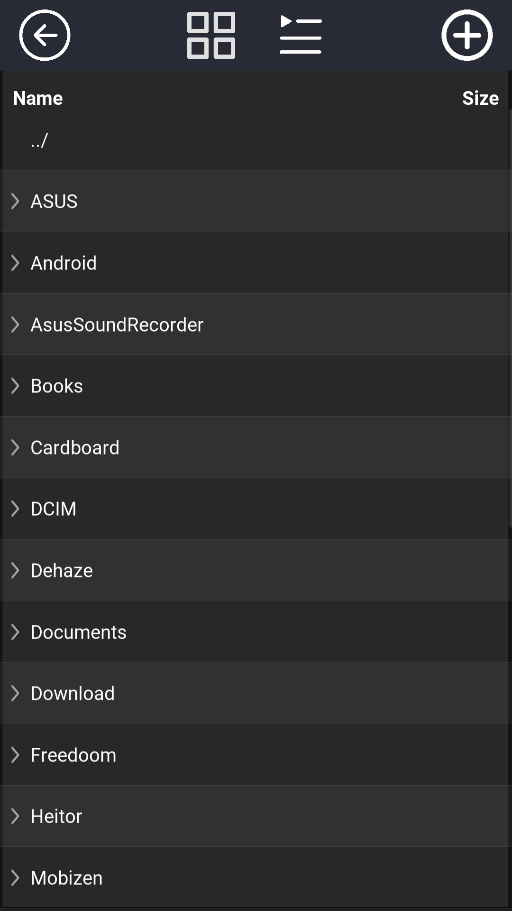
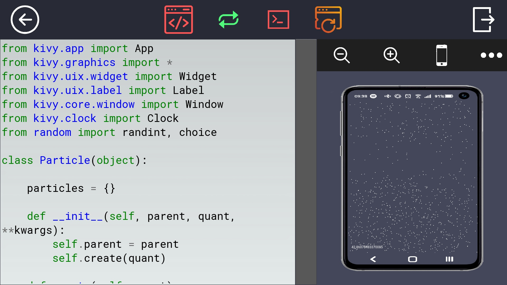
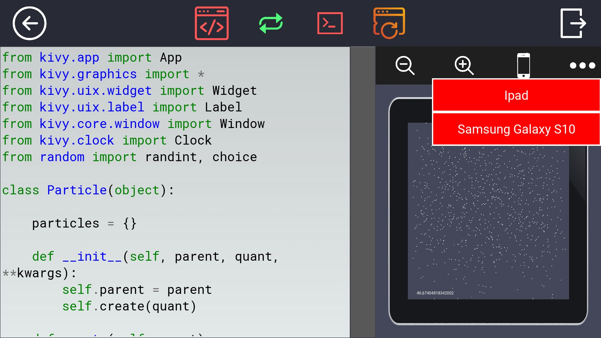

# KivyMaker
Aplicativo parecido com AndroidStudio, porém, para usar com a 
biblioteca Kivy

**Download para Windows 64 bits - https://www.mediafire.com/file/yjvr5a4zpjyhxmm/KvMaker.exe/file**

# Como usar:
Basta colocar o diretório do arquivo .py principal do seu projeto
na primeira pagina onde está escrito "Open File" e depois apertar
no Icone de pasta. Agora é só salvar o arquivo que está sendo editado
utilizando o "Ctrl + s" e o KivyMaker faz tudo para você!!

# IMPORTANTE
Fiz um vídeo no meu canal mostrando as funcionaliades e tudo mais,
se quiser saber mais sobre. Click no link abaixo:
 - https://www.youtube.com/channel/UCtzSRMR6zsv8ywCmm3O2XqQ

# KivyMaker Screens

# SmartPhone

 
 

# Search

# FileChooser

 
 

# Editor

# Options:

